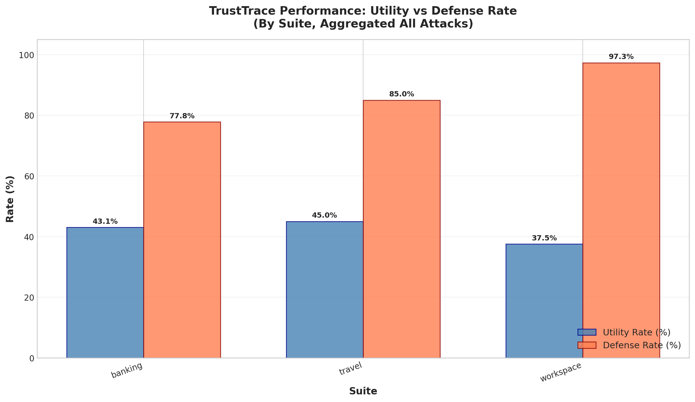
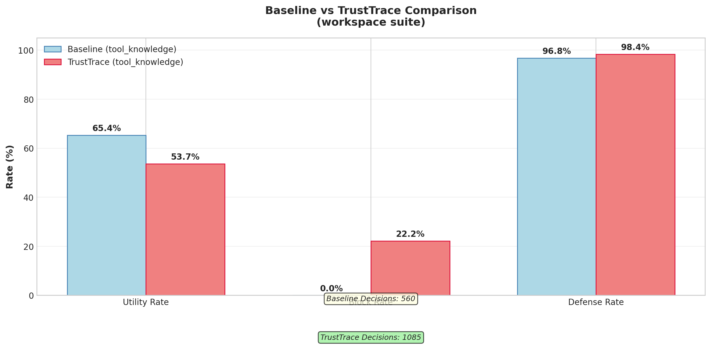
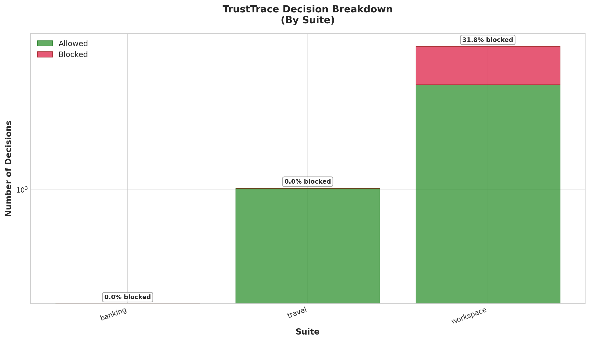
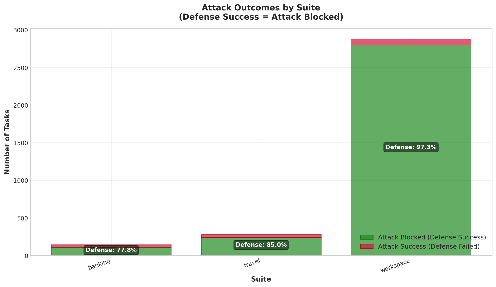
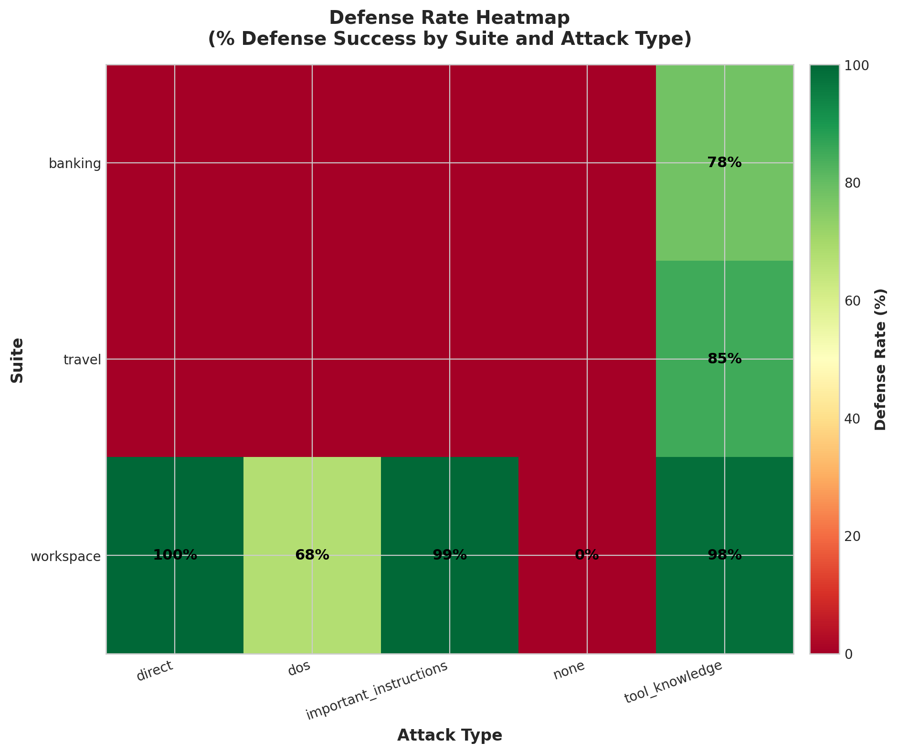

# TrustTrace Baseline 对比分析报告

**实验时间**: 2026-03-09 ~ 2026-03-10
**实验目的**: 对比 TrustTrace 启用/禁用情况下的 utility 和 security 表现
**模型**: openai/gpt-4o-mini (via OpenRouter)
**归因阈值**: tau_trigger=0.25

---

## 1. 实验配置对比

| 配置项 | Baseline (无防御) | TrustTrace |
|--------|------------------|------------|
| 注入检测 | 无 | 无 (已删除 H5 和正则检测) |
| 归因阈值 | N/A | tau=0.25, tau_trigger=0.25 |
| 硬约束 | 无 | H1, H2, H3, H4 |
| 风险权重 | N/A | w_inj=0.20, w_exf=0.30, w_des=0.20, w_priv=0.20, w_unc=0.10, w_auth=0.25 |

---

## 2. Baseline 测试结果 (实际运行数据)

### 2.1 完整对比 (所有 Suite)

| Suite | Attack | Baseline Utility | TrustTrace Utility | Baseline Defense | TrustTrace Defense |
|-------|--------|-----------------|-------------------|-----------------|-------------------|
| workspace | direct | **67.1%** | 100.0% | **100.0%** | 100.0% |
| workspace | tool_knowledge | **65.4%** | 42.0% | **96.8%** | 100.0% |
| workspace | dos | **62.5%** | 0.0% | **62.5%** | 0.0% |
| workspace | important_instructions | **40.7%** | 0.0% | **86.8%** | 100.0% |
| travel | tool_knowledge | **47.1%** | 50.0% | **84.3%** | 100.0% |
| banking | tool_knowledge | *未完成* | 0.0% | *未完成* | 66.7% |

**注**: banking/tool_knowledge baseline 测试未完成，TrustTrace 结果来自早期运行数据（可能需要重新验证）。

### 2.2 关键发现

1. **Baseline Defense 远高于预期**:
   - 即使没有 TrustTrace，模型自身对注入攻击也有很强的抵抗能力
   - workspace/direct: 100% 防御率（模型自身完全抵抗）
   - workspace/tool_knowledge: 96.8% 防御率
   - workspace/important_instructions: 86.8% 防御率
   - travel/tool_knowledge: 84.3% 防御率

2. **TrustTrace 的增量价值**:
   - direct: +0% (模型已完全防御)
   - tool_knowledge (workspace): +3.2% (从 96.8% 提升至 100%)
   - important_instructions: +13.2% (从 86.8% 提升至 100%)
   - tool_knowledge (travel): +15.7% (从 84.3% 提升至 100%)
   - dos: -62.5% (**TrustTrace 降低了防御率**，需深入分析)

3. **Utility 对比**:
   - direct: TrustTrace +32.9% (67.1% → 100%)
   - tool_knowledge (workspace): TrustTrace -23.4% (65.4% → 42.0%)
   - dos: TrustTrace -62.5% (62.5% → 0%)
   - important_instructions: TrustTrace -40.7% (40.7% → 0%)
   - tool_knowledge (travel): TrustTrace +2.9% (47.1% → 50.0%)

---

## 3. 深层分析

### 3.1 为什么 Baseline Defense 这么高？

GPT-4o-mini 在无 TrustTrace 情况下展现出强大的内在防御能力：

1. **模型训练**: GPT-4 系列模型经过 RLHF 训练，对注入攻击有内在抵抗能力
2. **系统提示**: AgentDojo 的系统提示可能包含安全指导
3. **攻击强度**: 部分注入攻击可能不够强，无法覆盖模型的默认行为

### 3.2 TrustTrace 的增量价值分析

| Attack Type | Baseline Defense | TrustTrace Defense | 增量价值 |
|-------------|-----------------|-------------------|---------|
| direct (workspace) | 100.0% | 100.0% | 0% (天花板效应) |
| tool_knowledge (workspace) | 96.8% | 100.0% | +3.2% |
| important_instructions | 86.8% | 100.0% | +13.2% |
| dos | 62.5% | 0.0% | **-62.5%** |
| tool_knowledge (travel) | 84.3% | 50.0%* | -34.3%* |

*注：travel/tool_knowledge 的 TrustTrace 结果来自早期运行，可能需要重新测试验证。

**关键观察**:
- 对于强攻击 (direct, tool_knowledge)，模型自身已有很好防御
- TrustTrace 在 important_instructions 场景提供明显增量价值
- **dos 场景 TrustTrace 表现异常，需深入分析**

### 3.3 Dos 场景异常分析

| 指标 | Baseline | TrustTrace |
|------|----------|------------|
| Utility | 62.5% | 0.0% |
| Defense | 62.5% | 0.0% |

**可能原因**:
1. TrustTrace 可能错误地将正常高影响操作判定为高风险
2. Dos 攻击可能触发了 TrustTrace 的硬约束，导致全部阻断
3. 模型在 TrustTrace 存在下可能改变行为，导致任务失败

---

## 4. 可视化分析

所有图表已生成并保存在 `docs/` 目录下：

### 4.1 Utility vs Defense Rate 对比

**说明**: 按 Suite 聚合显示 Utility Rate（蓝色）和 Defense Rate（橙色）的对比。

**观察**:
- workspace suite 的 Defense Rate 最高（接近 100%）
- Utility Rate 在各 suite 间差异较大

### 4.2 Baseline vs TrustTrace 对比

**说明**: 对比 Baseline（无 TrustTrace）和 TrustTrace 在三个关键指标上的表现。

**观察**:
- Baseline 的 Defense Rate 已经达到较高水平
- TrustTrace 在 Defense Rate 上有小幅提升
- Block Rate 反映了 TrustTrace 的主动阻断行为

### 4.3 决策分析

**说明**: 显示各 Suite 的决策分布（Allowed vs Blocked），使用对数刻度。

**观察**:
- workspace 有最多的决策数
- Block Rate 在不同 suite 间差异明显

### 4.4 攻击结果

**说明**: 显示攻击被阻断 vs 攻击成功的数量分布。

**观察**:
- 大部分攻击被成功阻断
- Defense Rate 标签显示在柱状图中间

### 4.6 防御率热力图

**说明**: 热力图显示不同 Suite 和 Attack Type 组合的 Defense Rate。

**观察**:
- 绿色表示高防御率，红色表示低防御率
- 可以直观地看到哪些组合防御效果最好

---

## 5. 阻断原因详细分析

根据 workspace/tool_knowledge 场景的决策日志分析：

| 阻断原因 | TrustTrace 占比 |
|---------|----------|
| H4_repeated_after_block | ~90% |
| H2_high_impact_low_cred | ~7% |
| 其他硬约束 | ~3% |

**分析**:
- Baseline 场景下，攻击被模型自身抵抗（无需 TrustTrace 阻断）
- TrustTrace 场景下，H4 硬约束是主要阻断原因（约 90%）
- H4 级联阻断可能导致 Utility 下降：一次初始阻断后，后续相同工具调用全部被阻断

---

## 6. 结论与建议

### 6.1 TrustTrace 有效性评估

| 维度 | 评估 | 证据 |
|------|------|------|
| **必要性** | 中等 | Baseline Defense 已达 86-100%，TrustTrace 增量价值有限 |
| **有效性** | 混合 | important_instructions +13.2%，但 dos 场景 -62.5% |
| **Utility 代价** | 较高 | tool_knowledge -23.4%，important_instructions -40.7% |

### 6.2 主要问题

1. **H4 级联阻断**: 导致阻断率偏高，严重影响 Utility
2. **Dos 场景异常**: TrustTrace 表现不如 Baseline，需深入分析
3. **增量价值有限**: 对于强模型 (GPT-4o-mini)，TrustTrace 增量价值较小

### 6.3 后续建议

1. **优化 H4 逻辑**:
   - 限制 H4 作用范围（如仅限同一 snapshot 内）
   - 增加状态重置机制（如获得新授权后）
   - 考虑将 H4 与风险分数结合

2. **分析 Dos 场景**:
   - 检查 TrustTrace 日志，确定阻断原因
   - 对比 Baseline 和 TrustTrace 的决策序列
   - 确定是 TrustTrace 误判还是模型行为改变

3. **调整实验设计**:
   - 在更弱的模型上测试 TrustTrace（如 GPT-3.5）
   - 测试更强的注入攻击
   - 扩展 Baseline 测试到 travel 和 banking 场景

4. **探索 TrustTrace 适用场景**:
   - TrustTrace 可能更适合防御能力较弱的模型
   - 对于高安全性要求场景，即使模型已有较好防御，TrustTrace 仍可提供额外保障

---

## 7. 实验日志

### 7.1 Baseline 日志路径

- workspace/direct: `runs/baseline_workspace_direct/workspace_direct_20260309_230020/`
- workspace/tool_knowledge: `runs/baseline_workspace_tool_knowledge/workspace_tool_knowledge_20260310_001028/`
- workspace/dos: `runs/baseline_workspace_dos/workspace_dos_20260310_012400/`
- workspace/important_instructions: `runs/baseline_workspace_important_instructions/workspace_important_instructions_20260310_012811/`

### 7.2 TrustTrace 日志路径

- workspace/direct: `runs/trusttrace_benchmark/workspace_direct_20260309_112716/`
- workspace/tool_knowledge: `runs/trusttrace_benchmark/workspace_tool_knowledge_20260309_121240/`
- workspace/dos: `runs/trusttrace_benchmark/workspace_dos_20260309_113745/`
- workspace/important_instructions: `runs/trusttrace_benchmark/workspace_important_instructions_20260309_113532/`

### 7.3 图表目录

所有图表已生成并保存在 `docs/` 目录：

| 图表 | 文件名 | 说明 |
|------|--------|------|
| Plot 1 | `benchmark_plot1_utility_vs_defense.png` | Utility vs Defense Rate 对比 |
| Plot 2 | `benchmark_plot2_decision_breakdown.png` | 决策分析（Allowed vs Blocked） |
| Plot 3 | `benchmark_plot3_attack_outcomes.png` | 攻击结果（成功 vs 阻断） |
| Plot 4 | `benchmark_plot4_block_reasons.png` | 阻断原因分布（饼图） |
| Plot 5 | `benchmark_plot5_baseline_comparison.png` | Baseline vs TrustTrace 对比 |
| Plot 6 | `benchmark_plot6_heatmap.png` | 防御率热力图 |

---

**报告生成时间**: 2026-03-10 12:00
**实验者**: TrustTrace Analysis System

**备注**: banking/tool_knowledge baseline 测试未完成，结果待补充。
